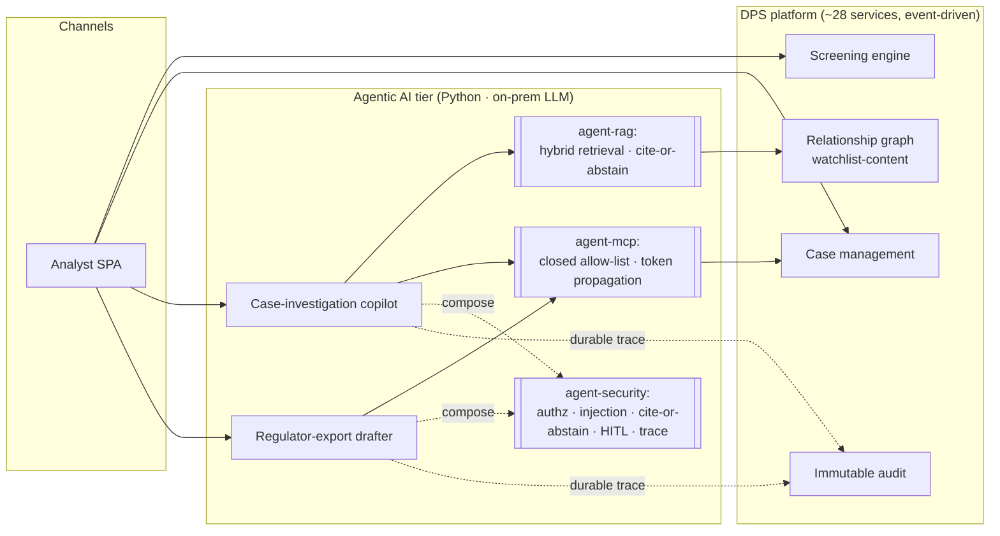

# Agentic Compliance Platform — engineering case study

A curated, sanitized case study of **DPS**, a denied-party-screening (sanctions/PEP/adverse-media)
compliance platform I designed and built solo — with a particular focus on its **agentic AI tier**:
LLM-powered analyst tools built to be *safe, grounded, and auditable* enough for a compliance
product.

> **Honest framing.** This is a deep, from-scratch engineering exercise — a production-*grade*
> platform running on a private lab, not a shipped SaaS with customers. There are **no invented
> users or metrics** here. What's interesting is the breadth and the engineering judgment, built
> end to end by one person: ~28 event-driven microservices, a relationship-graph intelligence
> layer, and an agentic AI tier designed against the OWASP LLM Top 10. This repo curates the
> AI-engineering-relevant parts with **real (sanitized) code**, the architecture, and the decision
> records — not the whole codebase.

---

## The thesis (why this is worth your time)

Most "I used an LLM" portfolios call a chat API and stop. The hard part of putting LLMs in a
**regulated** product is everything around the model:

- **Grounding** — never let the model invent a citation or a number.
- **Security** — prompt injection, tool poisoning, the confused-deputy problem, over-broad tool scope.
- **Human-in-the-loop** — the system must be able to *prove* the AI didn't make the decision.
- **Model-agnosticism** — no lock-in to one vendor or framework.

The load-bearing design constraint across the whole tier:

> **Agents are tools analysts use, not decisions the system makes.** Screening BLOCK/REVIEW/ALLOW
> and case dispositions stay deterministic and rule-traceable. The agent trace exists to *prove*
> the agent did not decide.

That single constraint is what makes an LLM feature legally saleable to a compliance buyer — and
it drove the architecture below.

---

## System at a glance

The agents never make decisions — they retrieve, draft, and *propose* (HITL); every action is
traced to an immutable audit log on the caller's own identity.

---

## What to read (this repo)

| If you care about… | Read |
|---|---|
| The AI tier as a whole + the "tools not decisions" stance | [`docs/agentic-ai/overview.md`](docs/agentic-ai/overview.md) |
| LLM **security** (injection, cite-or-abstain, HITL, trace) | [`docs/agentic-ai/security.md`](docs/agentic-ai/security.md) |
| **RAG** done defensively (hybrid retrieval, grounding) | [`docs/agentic-ai/rag.md`](docs/agentic-ai/rag.md) |
| **MCP** without the foot-guns (allow-list, confused-deputy, tool-poisoning) | [`docs/agentic-ai/mcp.md`](docs/agentic-ai/mcp.md) |
| The platform architecture (context for the AI tier) | [`docs/architecture.md`](docs/architecture.md) |
| How decisions were actually made (the judgment signal) | [`docs/decisions/`](docs/decisions/) |
| Real, sanitized code | [`code/`](code/) |

---

## Engineering signals (the short version)

- **Model-agnostic by construction** — the agent loop talks to a `Llm` Protocol, never a provider
  SDK. Runner + model are swappable per-agent behind a LiteLLM adapter (→ on-prem Ollama in the
  lab; $0 model fees, no counterparty PII leaving the network). Hand-rolled agent loops — **no
  LangChain** — for control and to actually own the IP. ([code](code/llm_port.py))
- **Cite-or-abstain** — an output validator rejects any answer that cites a source that wasn't
  retrieved, or makes claims with neither a citation nor an explicit abstention. (This caught a
  real fabricated-citation failure from a 7B model.) ([code](code/citation_validator.py))
- **MCP with the safety rails on** — a *closed allow-list* client (no dynamic server discovery),
  the caller's bearer propagated on every call (no confused deputy), and every call digested into
  the agent trace (size+hash, never raw tenant data). A tool-poisoning red-team harness proves a
  mutated tool description can't change behavior. ([code](code/mcp_client.py))
- **Hexagonal + DDD + event-driven at scale** — pure domain layers, ports/adapters, a transactional
  outbox, ArchUnit-enforced boundaries; ~28 services across data/operations/tenant planes.
- **Decision records** — ~40 ADRs. Real tradeoff reasoning (KC-Orgs vs realm-per-tenant; Postgres
  recursive-CTE graph vs a graph DB; Python agent tier vs in-JVM) — [`docs/decisions/`](docs/decisions/).
- **Engineering judgment, measured** — e.g. a graph-perf concern was *load-tested* (k6), the p95
  ceiling found, then fixed with a **cheaper composite-index + fan-out-cap mitigation** and
  **re-measured** (1.99s → 1.40s p95) — before reaching for a graph-database migration.

---

## Tech

**Backend:** Java 21, Spring Boot 3, Postgres, Redpanda (Kafka API), OpenSearch, MinIO, Keycloak (OIDC).
**Agentic tier:** Python, `uv`, FastAPI, LiteLLM → Ollama, MCP (Streamable HTTP), `mypy --strict`.
**Frontend:** React + TypeScript, OpenAPI-generated clients.
**Infra/obs:** Docker Compose, Traefik, Prometheus + Grafana + Loki + Tempo.

---

## Scope note

This repo is a **curated showcase**, not a runnable copy of the platform. Code is sanitized
(no secrets, no infra, no proprietary thresholds/weights) and chosen to be representative of the
engineering, with the full system described rather than dumped.
