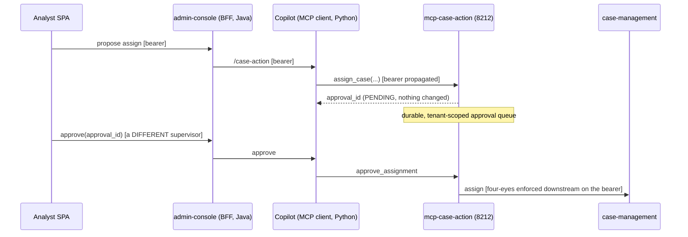

# MCP integration (ADR-0039)

Model Context Protocol gives agents a clean tool surface — and a fresh set of foot-guns. The two
non-negotiables I designed around:

1. **Token propagation** — the server acts as the *requesting user*, never an ambient service
   account. No confused deputy.
2. **Closed first-party allow-list** — no dynamic discovery of arbitrary servers. Dynamic discovery
   is the tool-poisoning / over-scope risk a compliance product can't take.

MCP sits **behind** the agent's typed tool ports (hexagonal preserved) — a direct-HTTP adapter and
an MCP adapter coexist per tool, config-selected. The transport is **Streamable HTTP** (these are
networked first-party services on the internal network, not stdio subprocesses).

## The client is the allow-list

The `McpToolClient` ([`code/mcp_client.py`](../../code/mcp_client.py)) takes a `dict[name, url]` at
construction — **that dict is the allow-list.** A call to any name not in it is refused *before any
network I/O*. Every call propagates the caller's bearer and is digested into the agent trace (size +
hash, never raw payload). Tracing is best-effort — it never breaks the call.

```python
client = McpToolClient({"case-action": "http://mcp-case-action:8212"}, recorder=trace)
await client.call("case-action", "assign_case", args, bearer=caller_bearer)  # ok
await client.call("some-other-server", "x", {}, bearer=caller_bearer)        # McpServerNotAllowed
```

## First-party servers (closed set)

| Server | Port | Surface |
|---|---|---|
| `mcp-regulator-export` | 8210 | Read-only proxy of the regulator-export package (consumed by the drafter). |
| `mcp-knowledge-retrieval` | 8211 | Read-only RAG retrieval — **tenant derived from the bearer server-side**, never a tool param (fail-closed against cross-tenant reads). |
| `mcp-case-action` | 8212 | The first *side-effecting* server — HITL-gated case writes via a durable approval queue. |

## The side-effecting write flow (case-action)

Java BFFs can't speak MCP, so the **Python copilot is the closed-allow-list MCP client**; the BFF
proxies the SPA to it. The whole chain enforces propose-then-approve:



The agent **proposes**; it never assigns. Approval requires a different human (four-eyes), enforced
downstream on the propagated bearer; idempotent assign makes the resolve a single-winner. Proposals
TTL-expire. The queue is durable (Postgres) — the agent tier stays the source of truth, the BFF
stays stateless.

## Why this is the hard part

The naive MCP integration — dynamic server discovery + a service-account token — is exactly the
confused-deputy + tool-poisoning vulnerability. Doing it *safely* (fixed allow-list, user-identity
propagation, behind typed ports, fully traced, red-teamed) is the engineering, and it's what makes
agent tool-use defensible in a regulated setting.
