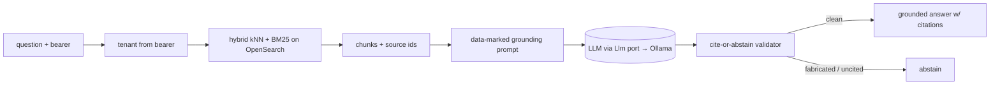

# Retrieval-augmented generation (ADR-0038)

The copilot answers compliance questions over tenant knowledge — and in this domain a confident
wrong answer (or an invented citation) is worse than "I don't know." So the RAG layer is built
defensively: tenant-isolated retrieval, on-prem embeddings, and a **cite-or-abstain** contract on
the output.

## Retrieval

- **Hybrid kNN + BM25** over OpenSearch — dense vectors catch semantic matches, BM25 catches exact
  terms/identifiers; together they beat either alone for compliance text (entity names, statutes).
- **Tenant isolation is structural** — the tenant is derived from the caller's bearer server-side
  and applied as a filter; it is **not** a tool parameter. A caller can reach their tenant's corpus
  plus a shared `public` corpus, nothing else. Fail-closed against cross-tenant reads.
- **On-prem embeddings** — `nomic-embed-text` on the lab's Ollama host. No document text leaves the
  network, consistent with the rest of the tier.
- **Provenance on every chunk** — each `Chunk` carries its source id so the answer can cite it and
  the validator can check the citation.

## Cite-or-abstain — the grounding contract

The model is constrained to **only** repeat retrieved content, *with attribution*, or abstain. The
validator ([`code/citation_validator.py`](../../code/citation_validator.py)) enforces it after
generation:

- Any cited source id that **wasn't in the retrieved set** → `citation_not_retrieved` (a fabricated
  citation) → reject.
- An answer that cites **nothing** and doesn't contain the explicit abstention token → `no_citation`
  → reject.

It composes with the `agent-security` output validators (`validate_all`), so cite-or-abstain and
"reject ungrounded numbers" run as one chain; any finding downgrades the response to an abstention.

## A real failure this caught

A 7B model (qwen2.5) under test produced a **fabricated citation** — a plausible-looking source id
that was never retrieved. The validator rejected it and the copilot abstained instead of returning
a confident, wrong, sourced-looking answer. That's the entire point: the smaller/cheaper the model,
the more the *system* has to guarantee grounding. The grounding lives in code, not in trusting the
model.

## Why on-prem + small-model is a feature

Running a modest on-prem model ($0 fees, no PII egress) is viable *because* the safety guarantees
are external to the model: deny-by-default authz, data-marking, output validation, cite-or-abstain,
and the durable trace. A bigger/faster hosted model is a one-line adapter swap behind the `Llm` port
([overview](overview.md)) — the grounding and security contracts don't change.
