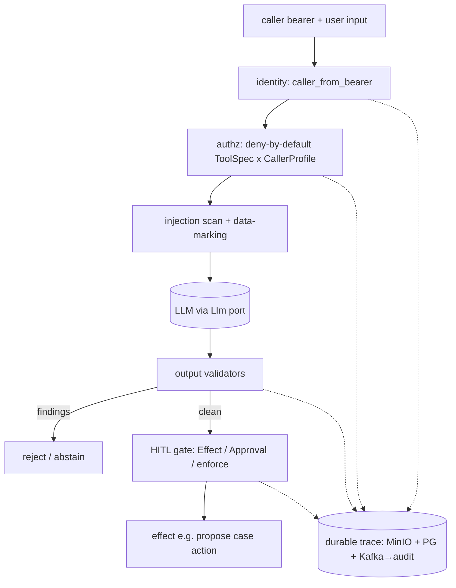

# Agent security baseline (ADR-0037)

The decision that shaped the whole tier: **security before features.** Before wiring more agent
capability, I built `agent-security` — a composable enforcement layer mapped to the **OWASP LLM
Top 10** — that every agent depends on. An agent isn't trusted to "be careful"; the controls sit
*around* the model and are deny-by-default.

## The pillars

| Module | What it does | OWASP LLM mapping |
|---|---|---|
| `identity` | `caller_from_bearer` — derive the `Caller` (subject, tenant, scopes) from the propagated JWT, server-side. | LLM08 (excessive agency) |
| `authz` | Deny-by-default `authorize(ToolSpec, CallerProfile)` — a tool runs only if the caller profile is explicitly allowed. | LLM08 |
| `datamarking` | Instruction/data separation — retrieved/user content is fenced as *data*, never merged into the instruction channel. | LLM01 (prompt injection) |
| `injection` | Heuristic `is_suspicious` scan on inbound content. | LLM01 |
| `output` | Composable validators (`validate_all`) — e.g. `UngroundedNumberValidator` rejects figures not in the source; cite-or-abstain plugs in here. | LLM02/LLM06 (insecure output / disclosure) |
| `hitl` | `Effect` / `Approval` / `enforce` — a side-effecting action becomes a *proposal* requiring human approval. | LLM08 |
| `trace` | `AgentTrace` + `DurableTraceRecorder` — one run fans out to three sinks. | LLM08 (provability) |

## Deny-by-default, not allow-by-omission

Authorization is the inverse of the usual "block the bad list." A tool is callable **only** if the
caller's profile is on its allow-list; anything unspecified is refused. Same for the MCP surface —
the allow-list *is* the config (see [mcp](mcp.md)). The point: a new tool or a new caller can't
accidentally gain reach; it has to be granted.

## Output validation can force an abstention

The model's output is not trusted. `validate_all` runs a chain of `OutputValidator`s; any finding
can downgrade the response to an abstention rather than return unsupported content. Two that matter
in compliance:

- **`UngroundedNumberValidator`** — rejects any number in the answer that doesn't appear in the
  grounding (no invented penalties, dates, or ownership figures).
- **cite-or-abstain** (from `agent-rag`, [`code/citation_validator.py`](../../code/citation_validator.py)) —
  rejects a cited source that wasn't retrieved, or claims with no citation and no abstention.

This generalizes to a simple rule: *the model may only repeat what it was given, with attribution,
or say it doesn't know.*

## Human-in-the-loop with provable non-autonomy

Side effects go through the HITL gate. A write (e.g. "assign this case") becomes a **proposal** in a
durable, four-eyes approval queue — the agent never executes it. Approval is enforced downstream on
the propagated human bearer, and the approver must differ from the proposer. The agent's role is
strictly *propose*; a human decides.

## The durable trace — proving the agent didn't decide

Every run produces an `AgentTrace` fanned to **three failure-isolated sinks**: the body to MinIO,
an index row to Postgres, and an event to Kafka (consumed by the immutable audit service). MCP tool
calls are traced too — *digested* (size + hash), never the raw payload, since results can be large
or carry tenant data. The trace is the evidence that the deterministic system — not the LLM — made
every BLOCK/REVIEW/ALLOW and disposition.

## Red-teamed, not assumed

`agent-redteam` is a test-only tool-poisoning harness: it mutates a shipped server's tool
description and asserts behavior is unchanged across the chain — detection (injection scan) →
containment (output validators) → gate (HITL). Each first-party server's tool description is
asserted clean in CI. Security properties are *tested*, not hoped for.
