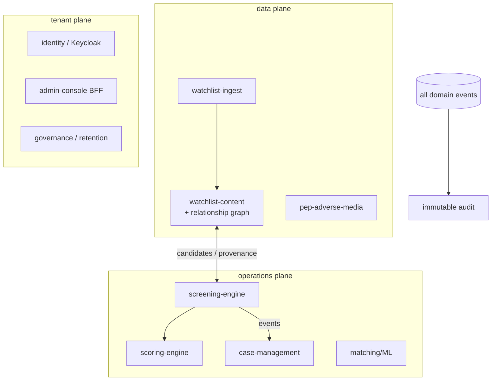

# Platform architecture (context)

The agentic tier doesn't float in space — it sits on a full compliance platform. This page is the
*context* for the AI work, not an exhaustive tour.

## Shape

- **~28 microservices**, one per bounded context, **event-driven** over a Kafka-API broker
  (Redpanda). Synchronous reads/commands over HTTP; cross-service side effects go out as events,
  not nested calls.
- **Hexagonal + DDD, enforced.** Every service: a pure `domain` layer (zero framework imports),
  an `application` layer of ports + use cases, and `infrastructure`/`api` adapters. The dependency
  rule (`api → application → domain ← infrastructure`) is enforced in CI by **ArchUnit** — a
  boundary violation fails the build.
- **Three planes** (a deliberate restructure): `data` (watchlist ingest/content, PEP/adverse-media),
  `operations` (screening, scoring, cases, matching/ML), `tenant` (identity, admin, billing,
  governance). Plane boundaries keep the eventual cloud carve-up clean.
- **Transactional outbox** for reliable event publication — domain change + outbox row commit in one
  transaction; a relay drains to Kafka. No dual-write race between the DB and the broker.

## The data / intelligence layer (what the AI tier draws on)

- **Watchlist corpus** — sanctions (OFAC/EU/UN/BIS…), PEP, and US adverse-media sources, ingested
  per-source with freshness telemetry, normalized + versioned, searchable via an OpenSearch index
  with a Beider-Morse phonetic analyzer for transliteration-tolerant name matching.
- **Relationship graph** — entity-to-entity edges (shareholder / UBO / director / …) from ICIJ
  Offshore Leaks + Wikidata, in Postgres. N-hop traversal via recursive CTEs powers an
  entity-centric investigation workspace and **indirect-exposure detection** ("is my counterparty
  connected to a sanctioned party through its ownership structure?").
- **Explainability + audit** — risk scores carry per-factor contributions; an immutable audit log
  captures every domain event; watchlist versions are pinned so a past decision can be replayed
  ("what lists/rules applied on date X").

## Engineering judgment, measured (not asserted)

A representative example of how decisions get made here. The Postgres recursive-CTE graph raised a
"will it scale?" question, so I:

1. **Instrumented** it — a percentile-histogram timer tagged by operation + hop depth, on a Grafana
   dashboard, so the perf question was *measurable*.
2. **Load-tested** it (k6) — found worst-case hub-node 3-hop p95 sitting right at the 2s budget,
   and discovered the cost was **fan-out (breadth) bound, not depth bound**.
3. **Fixed it cheaply first** — composite `(provenance, ref)` indexes + a per-hop fan-out cap in the
   recursive CTE, then **re-measured**: p95 1.99s → 1.40s, p99 2.40s → 1.43s.
4. **Deferred the expensive option** — a graph-database migration (Apache AGE / Neo4j) was the
   alternative; the measurement showed it wasn't needed yet.

Instrument → measure → cheapest effective fix → re-measure → defer the big rewrite until the data
demands it. That loop, not the specific result, is the point.

## Tech

Java 21 / Spring Boot 3 · Postgres · Redpanda · OpenSearch · MinIO · Keycloak (OIDC) ·
React/TypeScript (OpenAPI-generated clients) · Docker Compose · Traefik · Prometheus/Grafana/Loki/Tempo.
The agentic tier is a separate Python/`uv` stack ([agentic-ai/overview](agentic-ai/overview.md)).
